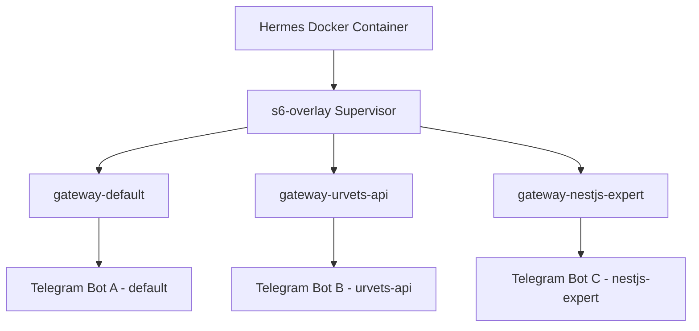

# 🤖 Multi-Instance Telegram Gateway Guide

This document describes the architecture and management of running **multiple concurrent Telegram Bot instances** inside a single supervised Hermes container.

---

## 🏛️ Architecture Overview

The Hermes Docker container utilizes the **s6-overlay** process supervisor to manage background services. Instead of running a single global gateway, Hermes spawns a separate supervisor service for each active profile:



Each process is completely isolated in its memory space, virtual environment, and configuration directory.

---

## 📂 Configuration Isolation

Each gateway reads its environment configuration exclusively from its profile directory. This prevents environment variable naming collisions:

| Profile Name | Local Config Path | Active Variables |
| :--- | :--- | :--- |
| **default** | `data/.env` | `TELEGRAM_BOT_TOKEN` (Bot A) |
| **urvets-api** | `data/profiles/urvets-api/.env` | `TELEGRAM_BOT_TOKEN` (Bot B) |
| **nestjs-expert**| `data/profiles/nestjs-expert/.env`| `TELEGRAM_BOT_TOKEN` (Bot C) |

---

## 🛡️ Platform Token Locks

To prevent race conditions and conflicts (such as two processes polling Telegram with the same token), Hermes implements a **Platform Lock** system:
* When a gateway starts, it registers a lock on its bot token (`telegram-bot-token:<TOKEN_HASH>`).
* Since each profile configured in this multi-instance architecture uses a **unique token**, each process successfully acquires its lock and runs independently.
* If you accidentally reuse the same token across different profiles, the supervisor logs will report a locking conflict, and the second process will fail to run until the conflict is resolved.

---

## 🛠️ Managing Supervisor Services

You can manage the individual gateway instances directly from your host machine via `docker exec`.

### 1. Check Service Status
Check the status of all supervised services, including process IDs (PIDs) and uptime:
```bash
# Check default gateway
docker exec hermes /command/s6-svstat /run/service/gateway-default

# Check urvets-api gateway
docker exec hermes /command/s6-svstat /run/service/gateway-urvets-api
```

### 2. Restart a Specific Bot/Gateway
If you modify a profile's `.env` or configurations, restart only that profile's gateway without affecting the others:
```bash
# Restart default gateway
docker exec hermes /command/s6-svc -t /run/service/gateway-default

# Restart urvets-api gateway
docker exec hermes /command/s6-svc -t /run/service/gateway-urvets-api
```

### 3. View Logs
Each bot instance writes its logs into its own profile workspace:
* **Default**: `data/logs/agent.log`
* **UrVets API**: `data/profiles/urvets-api/logs/agent.log`
* **NestJS Expert**: `data/profiles/nestjs-expert/logs/agent.log`

---

## 🔍 Troubleshooting

### Poll Conflict / Webhook Conflict
> [!WARNING]
> If you see `Conflict: terminated by other getUpdates request` in the logs:
> * Ensure you did not start the same bot token outside the docker container.
> * Ensure the bot token is not duplicated between different profiles.
